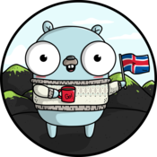

# Gophercon Iceland 2018

## Training Day
*May 31st, Reykjavik University*  

#### Advanced ultimate Go
**Speaker** 
[William Kennedy](http://twitter.com/goinggodotnet "William Kennedy")  
**Resources** 
https://github.com/ardanlabs/gotraining/tree/master/topics/go

------------

#### Production-ready microservices with Go and Kubernetes
**Speakers** 
[Elena Grahovac](http://twitter.com/webdeva "Elena Grahovac") 
[Alexey Palazhchenko ](http://twitter.com/paaleksey "Alexey Palazhchenko ") 
**Resources** 
https://github.com/k8s-community/k8s-workshop-eu 
https://github.com/rumyantseva/gophercon

------------

#### Go tooling in action
**Speaker** 
[Francesc Campoy](http://twitter..com/francesc "Francesc Campoy") 
**Resources** 
https://github.com/campoy/go-tooling-workshop

------------

#### Daily Go Fundamentals
**Speaker** 
[Mark Bates](http://twitter.com/markbates "Mark Bates") 
**Resources**

------------

#### Learn about and explore Machine Learning in Go
**Speakers** 
[Mat Ryer](http://twitter.com/matryer "Mat Ryer") 
[David Hernandez](http://twitter.com/dahernan "David Hernandez") 
**Resources** 
https://github.com/machinebox/gopherconeu

  
## Conference Day 1
*June 1st, Harpa Conference Centre* 

#### Observability-Driven Development
**Speaker** 
[Charity Majors](http://twitter.com/mipsytipsy "Charity Majors") 
**Resources** 
https://distributed-systems-observability-ebook.humio.com 
https://charity.wtf/

------------

#### Greedy alGOrithms
**Speaker** 
[Kaylyn Gibilterra](http://twitter.com/kgibilterra "Kaylyn Gibilterra") 
**Resources** 
https://speakerdeck.com/kgibilterra

------------

#### Building a Local Cloud [PaaS] for Africa
**Speaker** 
[Ian Juma](http://twitter.com/IanJuma "Ian Juma") 
**Resources**

------------

#### Develop Computer Vision Apps with Go
**Speaker** 
[Marian Montagnino](http://twitter.com/mmontagnino "Marian Montagnino")
**Resources**

------------

#### Painting with Light
**Speaker** 
[Hunter Loftis](http://twitter.com/HunterLoftis "Hunter Loftis") 
**Resources** 
https://speakerdeck.com/hunterloftis/painting-with-light 
https://github.com/hunterloftis/pbr

------------

#### Misnomers About Microbenchmarks
**Speaker** 
[Matt Silverlock](http://twitter.com/elithrar "Matt Silverlock") 
**Resources**

  
## Conference Day 2
*June 2nd, Harpa Conference Centre* 

#### Best Practices for Industrial Programming
**Speaker** 
[Peter Bourgon](http://twitter.com/peterbourgon "Peter Bourgon") 
**Resources** 
http://peter.bourgon.org/go-for-industrial-programming/

------------

#### Internal Architecture of Delve, a Debugger for Go
**Speaker** 
[Alessandro Arzilli](https://github.com/aarzilli "Alessandro Arzilli") 
**Resources**

------------

#### How do you structure your Go apps?
**Speaker** 
[Kat Zien](http://twitter.com/kasiazien "Kat Zien") 
**Resources** 
https://github.com/katzien/talks/blob/master/how-do-you-structure-your-go-apps/gopherconiceland-2018-06-02/slides.pdf 
https://github.com/katzien/go-structure-examples 
http://katzien.com

------------

#### Operating live on Kubernetes operators
**Speaker** 
[Kris Nova](http://twitter.com/krisnova "Kris Nova") 
**Resources** 
https://github.com/kris-nova/puffin-operator

------------

#### Tracing for granularity
**Speaker** 
[Jaana B. Dogan](http://twitter.com/rakyll "Jaana B. Dogan") 
**Resources** 
https://speakerdeck.com/rakyll/tracing-for-granularity

